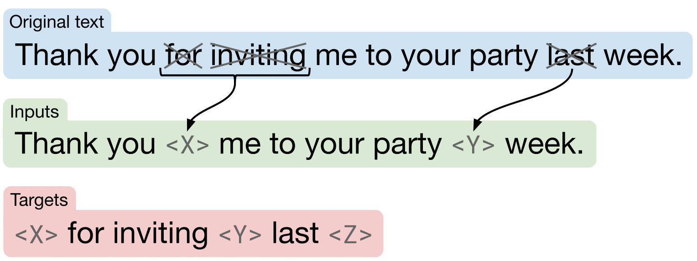

## <u>GoodReads Review Analysis</u>
Team:
- David Nicolay 26296918
- Kellen Mossner 26024284
- Matthew Holm 26067404

### 1. <u>**Introduction**</u>
Our analysis uses a variety of natural language processing techniques we learned in class to analyze book reviews from the our GoodReads dataset which we scraped. The main goals were to generate useful text like summaries, book descriptions, and star rating prediction, as well as to extract valuable information from user evaluations. Aspect-based sentiment analysis (ABSA), text generation, sentiment analysis, and summarization were some of the methods employed.

---
### 2. <u>**Ideas and Application**</u>
Our aim is to automate the analysis and synthesis of book reviews to make it easier to derive insights from books. Therefore, improving . The main ideas include:
- **Scraping**: Using R and Python to collect our data in an ethical and non-invasive way.
- **Preprocessing**: Preparing our scraped data for analysis in R.
- **EDA**: Exploring relationships and distributions of our predictors.
- **Sentiment Analysis**: Understanding the general sentiment of each review to classify it as positive, negative, or neutral for further interpretation.
- **Topic Analysis**: Trying to understand common themes or trends amongst positive and negative reviews respectively.
- **Summarization of Reviews**: Generating concise summaries for individual reviews, followed by a final summary that represents the overall opinion of readers.
- **Book Description Generation**: Creating a book description using text generation models based on the final summary.
- **Star Rating Prediction**: Predicting the star ratings which involve transforming the text data into numerical representations using TF-IDF vectorization and training a neural network model to classify the text into different star categories. Also includes attempts at regularisation to prevent overfitting.
- **Aspect-Based Sentiment Analysis (ABSA)**: Analyzing reviews based on specific aspects, such as plot, characters, or writing style, to provide a detailed sentiment evaluation for each aspect. Includes a simple and advanced approach.
---
### 3. <u>**Implementation**</u>
The implementation is divided into several stages - using R for EDA and basic sentiment analysis, using transformer-based models from Hugging Face's Transformers library and neural network models for multiple tasks:

1. **Sentiment Analysis**:
   - Lexicon-Based Sentiment Analysis with the NRC and Bing lexicons. Correlation detection between sentiment scores and star ratings along with visualization. All done in R.
2. **Summarization of Reviews**:
   - Individual reviews are summarized using transformers with the `facebook/bart-large-cnn` model, then an encoder-decoder approach with the pre-trained Sentence-BERT model. These models are fine-tuned for summarization tasks, generating concise versions of the original reviews.
   - A final summary is generated by clustering the most representative sentences from individual summaries.
3. **Book Description Generation**:
   - Text generation model BART is used with a prompt as an attempt to generate a 3rd person book description. The prompt-based text generation helps in making the description more engaging.
4. **Star Rating Prediction**:
   - A sequential neural network is implemented using TensorFlow Keras to predict star ratings based on the review text. The model is trained on a labeled dataset where the input features are the encoded review text and the target labels are the star ratings.
5. **Aspect-Based Sentiment Analysis (ABSA)**:
   - For ABSA, we used InstructABSA, a model that achieves high performance on benchmark datasets like SemEval 2014 Task 4. It is built on Tk-Instruct which is based off the T5 Text-To-Text Transformer model. The model provides fine-grained sentiment analysis for different aspects of the book, such as plot, characters, and writing style, offering a detailed understanding of each review's content. For a more in-depth explaination, refer to the `Summarization.ipynb` notebook.

---

### 4. <u>**Technical Summary of Pretrained Models**</u>

The ABSA field is an extremely active area of research. A popular dataset which is often used as a benchmark for ABSA models is the [SemEval 2014 Task 4](https://paperswithcode.com/sota/aspect-based-sentiment-analysis-on-semeval). We considered many alternative papers and datasets, and finally settled on [InstructABSA](https://arxiv.org/abs/2302.08624v6) due to its incredible performance on benchmarks and ease of use.

#### InstructABSA Architecture
This model introduces positive, negative, and neutral examples to each training sample, and instruction tune the model [Tk-Instruct](https://aclanthology.org/2022.emnlp-main.340/) for ABSA subtasks.

The ABSA subtasks can be represented as follows: Let $S_i$ represent the $i^{th}$ review sentence in the training sample, where $S_i = {w_{i}^1, w_{i}^2, ..., w_{i}^n}$ with $n$ as the number of tokens in the sentence. 
Each $S_i$ contains a set of aspect terms denoted by $A_i = {a_{i}^1, a_{i}^2, ..., a_{i}^m} | m \le n$, and the corresponding opinion terms and sentiment polarities for each aspect term are denoted by $O_{i} = {o_{i}^1, o_{i}^2, ..., o_{i}^m}$ and $SP_{i} = {sp_{i}^1, sp_{i}^2, ..., sp_{i}^m}$ respectively, where $sp_i^k \in [ positive, negative, neutral ]$. 
\
\
The ABSA tasks are described as follows:\
ATE: $A_i = LM_{ATE}(S_i)$\
ATSC: $sp_i^k = LM_{ATSC}(S_i, a_i^k)$\
ASPE: $[A_i, SP_i] = LM_{ASPE}(S_i)$\
AOOE: $o_{i}^k = LM_{AOOE}(S_i, a_i^k)$\
AOPE: $[A_i, O_i] = LM_{AOPE}(S_i)$\
AOSTE: $[A_i, O_i, SP_i] = LM_{AOSTE}(S_i)$\
\
In these equations, $LM$ represents the language model, and the corresponding inputs and outputs are defined accordingly. InstructABSA, in their approach, instruction tuned $LM_{subtask}$ by prepending task-specific prompts to each input sample to arrive at $LM_{subtask}^{Inst}$ 

We specifically consider ATSC for our use case of identify the sentiment around a specific aspect of a book review.

Image Source: [InstructABSA](https://arxiv.org/abs/2302.08624v6) 

Image Source: [InstructABSA](https://arxiv.org/abs/2302.08624v6) 

#### Tk-INSTRUCT

Tk-INSTRUCT is a transformer model trained to follow a variety of in-context instructions (plain language task definitions or _k_-shot examples). It builds on the T5 text-to-text transformer model using an instruction tuning approach. It converts diverse NLP tasks into a consistent instruction format through a task format:

- **Definition:** Task description
- **Things to avoid:** Common mistakes
- **Positive examples:** Good completions
- **Negative examples:** Poor completions
- **Input** 
- **Output**

#### Understanding the T5 architecture

Part of this image was adapted from: [Jay Alammar’s blog](http://jalammar.github.io/illustrated-transformer/)

At the bottom of the hierarchy of what we use lies T5, which stands for  _Text-To-Text Transfer Transformer_ proposed by [Google in 2020](https://arxiv.org/abs/1910.10683). It was trained on a cleaned common crawl web extracted [text corpus](https://www.tensorflow.org/datasets/catalog/c4). It is based on a BERT-sized encoder-decoder transformer which is illustrated in the image above. Since the dataset is unlabelled, an unsupervised objective was selected to allow learning from the unlabelled data. Words are dropped out independently and uniformly at random and replaced with a unique sentinel token. The model is then trained to predict sentinal tokens to delineate the dropped-out text (refer to image below). 

Image Source: [T5 Paper](https://arxiv.org/abs/1910.10683) 

To focus in on the core structure of the T5 transformer: 

**Input Representation**

1. Tokenization:

    Uses `SentencePiece`, which creates a vocabulary of subword units from an input text. For example the instruction "Summarize this review: This book rules!" could be tokenized into ["summarize", "_this", "_review", ":", "_This", "_book", "_rules", "!"].

3. Conversion to Token IDs:

    Every token is mapped to a unique integer ID from the vocabulary.

4. Embedding:

   The token IDs are then converted into dense vector embeddings, along with positional embeddings to encode the token's position in the sentence.

**Encoder**

The encoder stage is built with multiple layers (12 layers in T5-Base, the smallest T5 model). Each layer consists of:

1. Self-Attention Mechanism:

   This transforms the input text into 3 vectors through linear transformations of the input: _query_ ($Q$), _key_ ($K$) and _value_ ($V$). The attention mechanism then calculates a weighted sum of generated values based on the similarity between query and key vectors. It essentially takes into consideration the relationship among words within the same sentence. With self-attention, we are feeding the **same embedding into all 3 layers**. The attention formula:

$$
\text{Attention}(Q, K, V) = \text{softmax}\left(\frac{QK^T}{\sqrt{d_k}}\right)V
$$  

3. Feed-Forward Neural Network:

    2-layered fully connected network using the ReLU activation.

4. Layer Normalization:

    Applied before each sub-layer to stabilize training (pre-norm), this makes the model more robust to learning rate changes. T5 does not use scaling (gamma) and bias (beta) parameters.

5. Residual Connections:

   Skip-connections are also included around each sub-layer to improve gradient flow during training. This ensures the model does not rely on certain weights too heavily.

**Decoder**

The decoder also consists of multiple layers (12 layers in T5-Base). Each layer includes:

1. Self-Attention Mechanism:
 
    The implementation is similar to the encoder. The addition of masking ensures that positions do not attend to future positions in the output sequence.

3. Cross-Attention Mechanism (Encoder-Decoder Attention):

    This enables each position in the decoder to attend to all positions in the encoder’s output.

4. Feed-Forward Neural Network:

    Same concept as the encoder.

5. Layer Normalization:

    Applied before each sub-layer (pre-norm), similarly to the encoder.

6. Residual Connections:

    Same as the encoder.

---
### 4. <u>**Results and Findings**</u>
- **Sentiment Analysis**: Most reviews tend to be positive, reflecting a general tendency for people to write reviews for books they enjoyed. However, some genres had more polarized sentiments (such as horror).
- **Summarization**: The generated summaries effectively captured the main points of each review, helping to distill lengthy reviews into concise reviews.
- **Book Descriptions**: Text generation for book descriptions was successful in producing engaging content, although fine-tuning the prompt was necessary to ensure descriptions sounded more objective. One of the biggest issues was 3rd person generation, which wasn't obtained consistently.
- **Star Prediction**: The sequential model demonstrated inconsistent results - the accuracy was low and the models showed signs of overfitting. Regularisation methods did not yield much better results. There were some promising results when inputting shorter reviews.
- **Aspect-Based Sentiment Analysis**: ABSA provided a nuanced view of reviews by highlighting specific aspects praised or criticized by readers. For instance, certain books received high praise for plot development but were critiqued for character depth.
---
### 5. <u>**Ethical Considerations**</u>
- No personal data was scraped.
- Data is used exclusively for demonstrating the NLP and Deep Learning methods we were taught in class.
- In implementing our web scraper we made sure to use time.sleep() in order to not overload the servers for [goodreads.com](http://goodreads.com) with constant requests from our scraper.
- We also made sure to not bypass and security measures that were in place to prevent web scrapers from accessing the website. We only scraped the data that is publicly available.
---
### 6. <u>**Conclusions**</u>
Our attempt shows how well sophisticated NLP approaches work for automating the examination of book reviews. A thorough grasp of reader attitudes may be obtained by combining sentiment analysis, aspect-based sentiment analysis, summarization, and text production. The methods used not only help in summarizing large volumes of text but also in generating new content, such as book descriptions, that can be useful for readers, authors, and publishers. This entire process is applicable to many different review contexts (granted to data is easily available).

---
### 7. <u>**Final Product On Website**</u>
Note the "Readers Praise", "Readers Dislike" and "Reviews Summary" sections.

